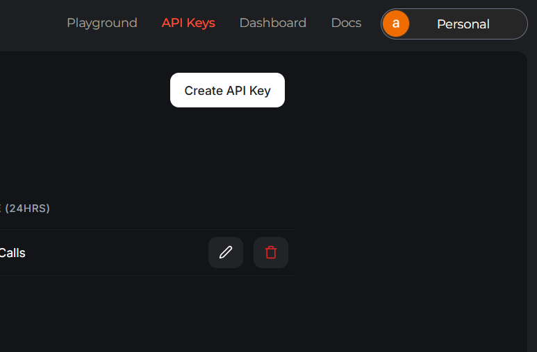
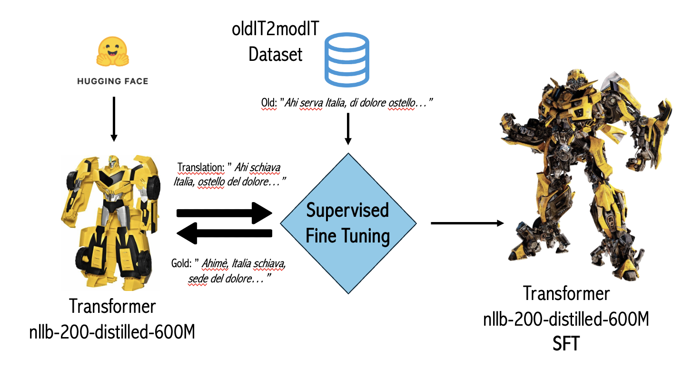

# oldIT2modIT


The task of this homework consists in translating a dataset from archaic italian to modern italian using LLMs and evaluating them using an LLM-as-a-Judge. Firstly we have created a NEW dataset called ["oldIT2modIT"](https://huggingface.co/datasets/cybernetic-m/oldIT2modIT) available on HuggingFace! It contains 200 old (ancient) Italian sentences and modern Italian sentences from authors in 1200-1300 period, as Dante Alighieri, Bono Giamboni, Torquato Tasso, Ludovico Ariosto and others. 
For this task we have used two type of LLMs (`deepseek-r1-distill-llama-70b`, `gemma2-9b-it`) using the [Groq API](https://groq.com/) and one Transformer-based approach (`nllb-200-distilled-600M`), both original and also doing a Supervised Fine Tuning (SFT) using the previous mentioned dataset.
The evaluation procedure was done using [`Prometheus-Eval`](https://github.com/prometheus-eval/prometheus-eval) as LLM-as-a-Judge, using rubric scores on five different metrics: Meaning Preservation, Grammar, Modern Structural Effectiveness, Completeness and Lexical Modernization. The Prometheus-Eval evaluator needs also "gold" labels (it means the translations of the original dataset.csv), but we did not have them: then, we have also translated the original dataset.csv file using ChatGPT 4o and validating manually each sentence, creating the dataset_gold.csv dataset.

# ⚠️TAs Instructions⚠️

1. **Clone the repository**:  
 ```sh 
git clone "https://github.com/cybernetic-m/archaicIT2modernIT.git"
 ```

2. **Make a Groq API Key**:
   
It is needed to run the LLMs used for the translations. 
Go to https://console.groq.com/keys. 
Do the login and click on "Create Api Key" in the top right corner.


3. **Open in colab hw2_Romano_LissaLattanzio":**

There you can try to:
 - **Run the LLM based approach**
 You can try to re-translate the dataset using the zero-shot or the few-shot by opening the LLM based approach in the notebook.
 
 - **Run the transformer based approach**
 You can try the fine tuning of the transformer and the translation using the non fine tuned and fine tuned transformers in the transformer based aproach section.
 
 
 
 - **Run the LLM as a judge**
 You can try our tournament selection and absolute evaluations in the LLM as a judge section.

4. **(Optional) Change the `config.yaml`**
You can change:
- **model:** Change the models (`llama`, `deepseek`, etc.) and `temperature` value
- **prompt:** Edit system and user prompts for both Italian and English translations
- **prometheus_judge:** Change the system and user prompts for both `relative` and `absolute` evaluation modes
- **rubrics:** Modify the criteria descriptions used for scoring (e.g. grammar, completeness)
- **data.input_file:** Point to a different CSV input dataset
- **rate_limit:** Adjust the allowed number of requests per minute

# ☁️ TAs GDrive Shared Folder ☁️

On the [Caponata_Lovers_hw2_shared_folder ](https://drive.google.com/drive/folders/1an6QsdK0kBZE63KZJgOVvfnzcqpunQCD?usp=drive_link)  you can see different folders where we uploaded the files of the translations, we actually made also the translations using english prompts but we cut them for time reason and GPU limits of colab for the prometheus approach.

1. *translations folder*: contains the following folders of translations:
 - "*fewShot1_temp0_it*": this folder contains the translations of deepseek-lama and gemma with 1-shot, temperature 0, language of the prompt in italian.
 - "*fewShot2_temp0_it*": this folder contains the translations of deepseek-lama and gemma with 2-shot and temperature 0, language of the prompt in italian.
 - "*fewShot3_temp0_it*": this folder contains the translations of deepseek-lama and gemma with 3-shot and temperature 0, language of the prompt in italian.
 - "*fewShot4_temp0_it*": this folder contains the translations of deepseek-lama and gemma with 4-shot and temperature 0, language of the prompt in italian.
 - "*fewShot5_temp0_it*": this folder contains the translations of deepseek-lama and gemma with 5-shot and temperature 0, language of the prompt in italian.
 - "*zeroShot_temp0_it*": this folder contains the translations of deepseek-lama and gemma with 0-shot and temperature 0, language of the prompt in italian.
 - "*transformers*": this folder contains the translations of the transformer fine tuned and non fine tuned.

2. *evaluations folder*: contains the following evaluations file:
 - "*deepseek_evaluation.jsonl*": this file contains the evaluations for deepseek for each of the 5 metrics
 - "*gemma_evaluation.jsonl*": this file contains the evaluations for gemma for each of the 5 metrics
 - "*transformer_ft_evaluation.jsonl*": this file contains the evaluations for the fine tuned transformer for each of the 5 metrics
 - "*transformer_non_Ft_evaluation.jsonl*": this file contains the evaluations for the non fine tuned transformer for each of the 5 metrics

3. *dataset_gold* file contains our dataset of 200 sentences used for the fine tuning of the transformer.

# Repository Structure
 ```sh
.
├── LICENSE
├── README.md
├── config.yaml
├── data
│   ├── dataset.csv
│   ├── dataset_gold.csv
│   ├── examples.csv
│   └── oldIT2modIT.csv
├── deepseek_tournament_winners.txt
├── evaluations
│   ├── deepseek_evaluation.jsonl
│   ├── evaluation_guidelines.txt
│   ├── gemma_evaluation.jsonl
│   ├── transformer_ft_evaluation.jsonl
│   └── transformer_non_ft_evaluation.jsonl
├── figures
│   └── metrics_comparison.png
├── gemma2_tournament_winners.txt
├── groq_api_key.txt
├── human_correlation
│   ├── deepseek_eval_correlation.jsonl
│   ├── gemma_eval_correlation.jsonl
│   ├── transformer_ft_eval_correlation.jsonl
│   └── transformer_non_ft_eval_correlation.jsonl
├── prompt
│   ├── PromptBuilder.py
│   └── evaluation.py
├── tournament
│   └── tournament.txt
├── translations
│   ├── fewShot1_temp0_it
│   │   ├── CaponataLovers-hw2_transl-deepseek-r1-distill-llama-70b_few-shot_k-1_it_temp-0.0.jsonl
│   │   └── CaponataLovers-hw2_transl-gemma2-9b-it_few-shot_k-1_it_temp-0.0.jsonl
│   ├── fewShot2_temp0_it
│   │   ├── CaponataLovers-hw2_transl-deepseek-r1-distill-llama-70b_few-shot_k-2_it_temp-0.0.jsonl
│   │   └── CaponataLovers-hw2_transl-gemma2-9b-it_few-shot_k-2_it_temp-0.0.jsonl
│   ├── fewShot3_temp0_it
│   │   ├── CaponataLovers-hw2_transl-deepseek-r1-distill-llama-70b_few-shot_k-3_it_temp-0.0.jsonl
│   │   └── CaponataLovers-hw2_transl-gemma2-9b-it_few-shot_k-3_it_temp-0.0.jsonl
│   ├── fewShot4_temp0_it
│   │   ├── CaponataLovers-hw2_transl-deepseek-r1-distill-llama-70b_few-shot_k-4_it_temp-0.0.jsonl
│   │   └── CaponataLovers-hw2_transl-gemma2-9b-it_few-shot_k-4_it_temp-0.0.jsonl
│   ├── fewShot5_temp0_it
│   │   ├── CaponataLovers-hw2_transl-deepseek-r1-distill-llama-70b_few-shot_k-5_it_temp-0.0.jsonl
│   │   └── CaponataLovers-hw2_transl-gemma2-9b-it_few-shot_k-5_it_temp-0.0.jsonl
│   ├── transformers
│   │   ├── CaponataLovers-hw2_transl-nllb-200-distilled-600M-finetuned.jsonl
│   │   └── CaponataLovers-hw2_transl-nllb-200-distilled-600M.jsonl
│   └── zeroShot_temp0_it
│       ├── CaponataLovers-hw2_transl-deepseek-r1-distill-llama-70b_zero-shot_it_temp-0.0.jsonl
│       └── CaponataLovers-hw2_transl-gemma2-9b-it_zero-shot_it_temp-0.0.jsonl
└── utils
    ├── cohen_kappa.py
    ├── config.py
    ├── evaluation.py
    ├── evaluation_prometheus.py
    └── translate.py

 ```

# Authors
[Massimo Romano](https://sites.google.com/studenti.uniroma1.it/romano/home-page?authuser=0)
[Antonio Lissa Lattanzio]()


